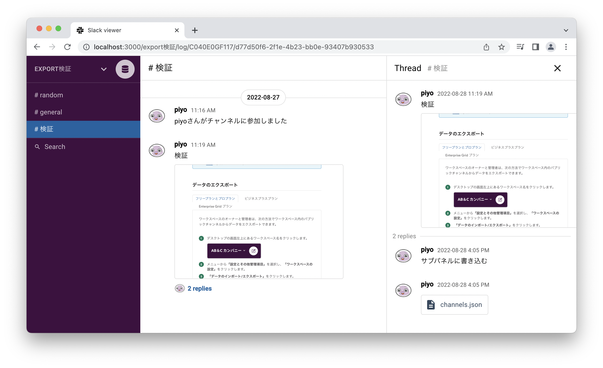
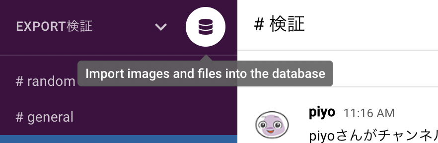

# Slack archive viewer
Zip files exported from salck are displayed in an easy-to-read format 😉


## Contents
* [Overview](#overview)
* [Setup](#installation)
* [Usage](#usage)

## Overview

With Slack's new plan revision, logs that will be deleted in 90 days can be reused in an easy-to-read format.  
You can also save data on the Slack server, such as images and files, locally.

### Demo
[demo site](https://slack-viewer-fe9fe.web.app/)

## Setup
```
cd slack-archive-viewer

npm install
npm start
```

## Usage

### Log preview
1. Export the Slack workspace you are using
2. Start slack-archive-viewer
```
npm start
```
3. Click the `Import Slack zip file` button to upload the zip file

### Store data locally
🚨 Saving data requires avoiding CORS errors 🚨  
If you want to store images and files in the database, you need to avoid CORS errors.

a. Launch browser with CORS error disabled
Execute the following command in the terminal

Windows OS : 
```
[PATH_TO_CHROME]chrome.exe" --disable-web-security --disable-gpu --user-data-dir=~/chromeTemp
```
Mac OS : 
```
open -n -a /Applications/Google Chrome.app/Contents/MacOS/Google Chrome --args --user-data-dir="/tmp/chrome_dev_test" --disable-web-security
```

b. Disable with browser add-ons
* [CORS Unblock](https://chrome.google.com/webstore/detail/cors-unblock/lfhmikememgdcahcdlaciloancbhjino?hl=en) (Chrome add-on)

#### Data Storage Procedures
To save data, simply click on the database icon after uploading the logs you wish to save. 


* Store data in the [indexed DB](https://developer.mozilla.org/en-US/docs/Web/API/IndexedDB_API) implemented in the browser
* Database deletion function not yet implemented (please delete manually from the browser's developer tools 🙇🏻‍♂️ )